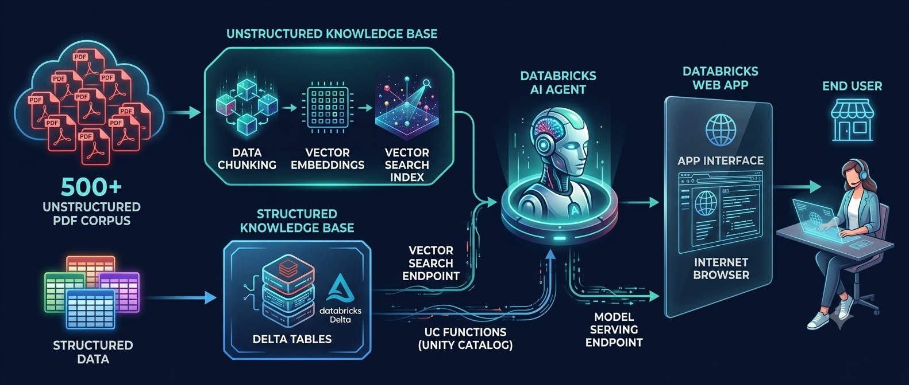
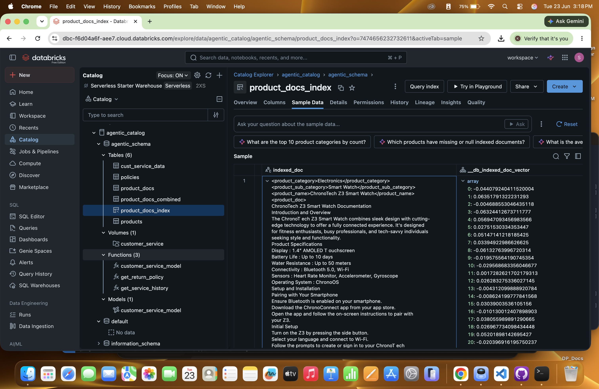
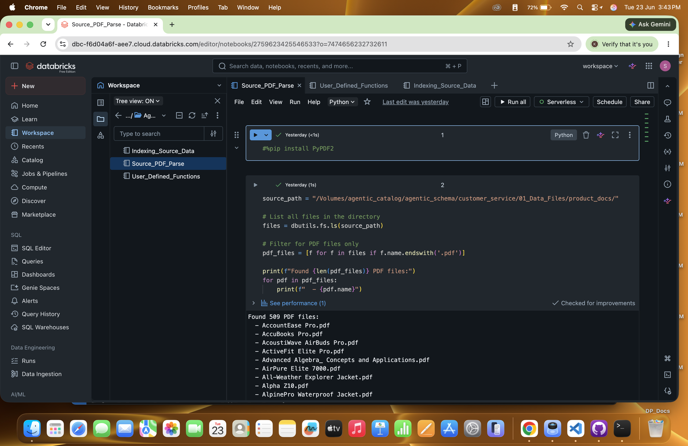
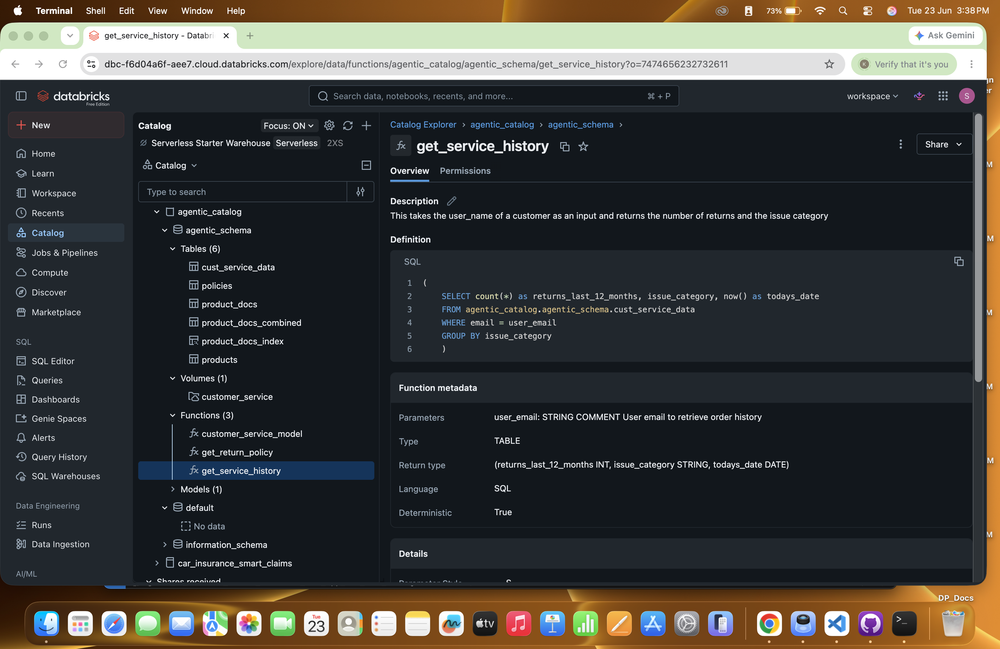
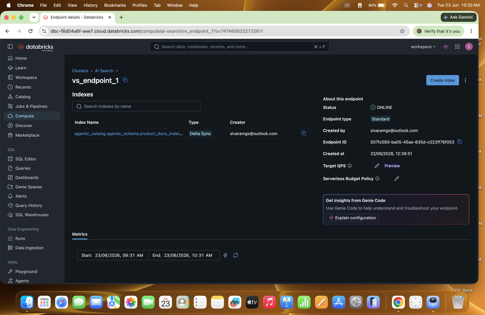
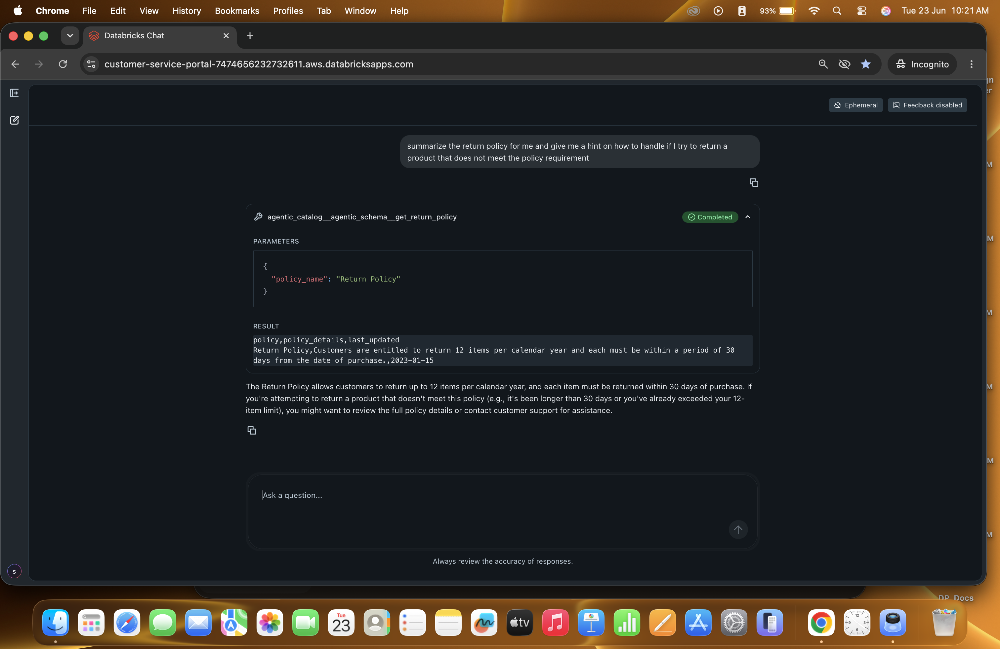

### 🛠️ Tech Stack:

1. gemma-3-12b-it
2. Databricks AI Agent
3. Delta Tables
4. MLFLOW
5. Unity Catalog Functions
6. RAG (Retrieval-Augmented Generation)
7. MCP (Model Context Protocol)

### Architecture:

### Project: 

1. Dual-Stream Knowledge Bases

The platform ingests both unstructured and structured data sources to build a holistic context engine:

    Unstructured Knowledge Base (PDF Processing Pipeline):

        Source data (e.g., 500+ PDF files) is ingested and broken down into smaller, semantic Chunks.

        These chunks are processed through an embedding model to generate high-dimensional text Embeddings.

        The embeddings are indexed into a Databricks Vector Search Index to enable fast, semantic similarity lookups.

    Structured Knowledge Base (Tabular Data Pipeline):

        Relational tables and structured files are ingested directly into Delta Tables on Databricks storage, ensuring ACID compliance, high performance, and historical versioning.

2. Intelligent Routing via DB Agent (Databricks Agent)
    At the core of the architecture sits the DB Agent, which functions as the orchestrator to dynamically retrieve context based on the user's inquiry:

    Vector Search Endpoint: The agent queries the unstructured knowledge base via a managed Vector Search endpoint to retrieve relevant document context.

    Unity Catalog (UC) Functions: For structured data inquiries, the agent leverages Unity Catalog (UC) Functions as native tools to programmatically query, aggregate, and retrieve metrics securely from the Delta Tables.

    

    

3. Model Serving & Application Delivery

    Once the context is gathered and reasoning is complete, the solution transitions from backend processing to client delivery:

    The DB AI Agent is deployed and exposed via a production-ready Databricks Model Serving Endpoint.

    A web-based Databricks App (accessible via a standard Internet Browser) interfaces with this endpoint to provide an intuitive graphical user interface.

    

4. End User Interaction

    The End User interacts with the web interface to submit queries and receives accurate, grounded, and context-aware responses driven by the underlying unified knowledge bases.
    
    
